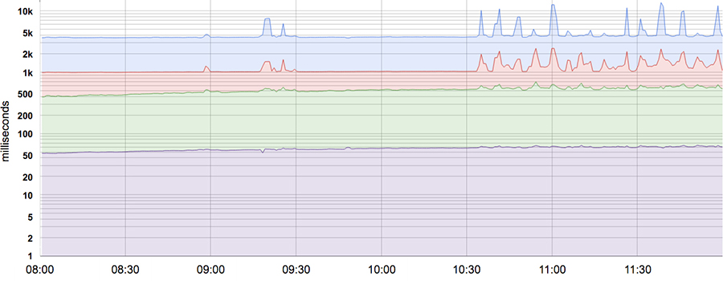

# Service Level Objectives

Uses the [Shakespeare service example](00-shakespeare-service.md) as an example service.

## Table of contents

- [Service Level Objectives](#Service-Level-Objectives)
  - [Table of contents](#Table-of-contents)
    - [Service Level Terminology](#Service-Level-Terminology)
      - [Service Level Indicators (SLI)](#Service-Level-Indicators-SLI)
      - [Service Level Objectives (SLO)](#Service-Level-Objectives-SLO)
      - [Service Level Agreements (SLA)](#Service-Level-Agreements-SLA)
    - [Indicators in Practice](#Indicators-in-Practice)
      - [What do You and your Users care about](#What-do-You-and-your-Users-care-about)
      - [Collecting indicators](#Collecting-indicators)
      - [Aggregation](#Aggregation)
    - [Objectives in Practice](#Objectives-in-Practice)
      - [Defining Objectives](#Defining-Objectives)
      - [Choosing Targets](#Choosing-Targets)
      - [Control Measures](#Control-Measures)
      - [SLOs Set Expectations](#SLOs-Set-Expectations)
  
----

### Service Level Terminology

#### Service Level Indicators (SLI)

A defined quantitative measure of the level of a provided service.

Examples:

- request latency; how much time it takes for returning a response to a request.
- error rate; a percentile or fraction of received requests.
- system throughput; measured as request per second.
- availability; the fraction of time in which a service is usable.
- yield; the fraction of well-formed and successful requests.
- durability; the likelihood of data-retention over a long period of time. Particularly important for storage systems.

The measurements are often aggregated. Meaning it's collected over a period of time. Depending on the type of measurement, it is then turned into rates, averages or percentiles.

#### Service Level Objectives (SLO)

A target value or range of values for a service level, measured by an SLI. e.g:
*SLI*  ≤ *target*
*lower bound* ≤ *SLI* ≤ *upper bound*

In some cases it is difficult to define a SLO. In particular you might not always be able to define its value. For instance, to measure incoming HTTP requests from the outside world to your service, you may use the queries per seconds (QPS) metrics.
This might seem like a good idea. But you may realise that it can't reliably be measured due to the QPS being dependant on your users' desire to use your service.
However, there are cases where you can add a value to a SLO. For instance a SLO with a value could be "the Shakespeare service should have an average *request latency* lower than 100 ms".
This SLO may motivate your team to write the front-end with low-latency behaviour. Or it may motivate you to purchase low-latency equipment.

Yet, it may be more subtle than only having the latter SLI (request latency) in the SLO. The QPS and request latency may be connected behind the scenes. A higher QPS or throughput would likely increase the request latency. Besides, it's common for services to have a performance cliff beyond some load threshold.

If possible, publishing the SLOs to end-users may be useful. This may aid with managing users' expectations on the service, such as availability. Users are likely to develop their own expectations if an explicit SLO isn't available.
This dynamic can lead to both over-reliance on the service and under-reliance.

An example is the **Global Chubby (Google's lock service) Planned Outage**:

The problem Google was facing was that the lock service was far too reliable, to the point where users and services would rely on it to never be down.
This lead to external services being too reliant on it being available, creating tight coupling.
The solution was to have planned outages. In that way, Google was able to flush out any *unreasonable dependent* (external) services.
Doing so ensured that any external services weren't too reliant on Chubby.

#### Service Level Agreements (SLA)

An explicit or implicit contract with your users that includes consequences of meeting (or missing) the SLO(s) they contain.
Most commonly these consequences are financial and may incur a penalty. As such it's easy to distinguish between an SLA and SLO.
When there is no explicit consequence if the SLO isn't met, it's not an SLA.

SRE typically don't get involved in constructing SLAs, because they are too closely tied to Business and Product decisions. They do get involved in helping not triggering the consequences of missed SLOs. Additionally, SRE identify the SLIs that are the foundation for the SLOs.

### Indicators in Practice

In this section "indicators" is shorthand for Service Level Indicators.

We've established *why* choosing appropriate metrics to measure your service is important.
But how do we go about identifying what metrics are meaningful for your service?

#### What do You and your Users care about

All metrics you monitor shouldn't be considered SLIs, but all SLIs are based on metrics.
If you consider all your metrics as SLIs, it will be difficult to pay the right level of attention to them all.
Meaning you may lose track of the more important metrics in the noise.
But, choosing too few metrics may leave significant behaviour unexamined.
Having an understanding of what your users want from your service should be at the core of your SLIs.
Below are some examples of SLIs based on broad service categories:

- **_User-facing systems_** (such as the Shakespeare front-end). Emphasises *availability*, *latency* and *throughput*. Example SLIs could be based on:
  - "Could we respond to the request?"
  - "How long did it take?"
  - "How many requests can be handled?"
  
- **_Storage systems_**. Emphasises *availability*, *latency* and *durability*. So SLIs may be based on:
  - "How long does it take to read or write data?"
  - "Can we access the data on demand?"
  - "Is the data still there when we need it?"
  
- **_Big data systems_**. Emphasises *throughput* and *end-to-end latency*. In other words SLIs may be based on:
  - "How much data is being processed?"
  - "How long does data ingestion take?"

- **_All systems_** emphasise *correctness*. As such SLIs may be based on:
  - "Was the right answer returned?"
  - "Was the right data retrieved?"
  - "Was the right analysis done?"

#### Collecting indicators

Many (if not most) indicators exist on the server side, such as HTTP 500 responses as a fraction of all requests.
But, it may be worth considering also having client-libraries to scrape metrics.

**Consider this scenario**:

We are monitoring how long it takes to respond to a request from the back-end in the Shakespeare service.
As such, we have an indicator on how much time a response from the back-end to the front-end will take.

However, we have no way of knowing how long it takes for the front-end to load the response.
What if the front-end is taking a longer than usual time to load its JavaScript?
Because the services are decoupled, the back-end service is unable to monitor that indicator.
So we may need to use the browser as a proxy, to monitor the actual end-user experience.

#### Aggregation

Metrics, and how they are collected, can be deceptively complex. Consider a system that receives 200 requests every odd-numbered second, but 0 requests on even-numbered seconds.

Wildly different assumptions can be made depending on *how often* that metric is obtained. If the system measures the average number of requests over a minute, it will show 100 requests/second. But, if the system obtains the metric *every second*, we can see an **instantaneous** load that is twice as high as the averaged metric.

Because of this, it's better to think of most metrics as distributions rather than averages. For instance, for a latency SLI, some requests will be serviced quickly. But some may take *much* longer.

If the system only measures the SLI's metrics through averaging the measured requests it may obscure those long responses. [Figure 4-1](#figure_4-1) provides an example where the average request is served in 50 ms, but 5% of the request take 20 times(!).

<a name="figure_4-1"/> 
**Figure 4-1: 50th, 85th, 95th, and 99th percentile latencies for a system.**

Following the [figure](#figure_4-1) it would be problematic to alert on the average service time, as it doesn't show any change over the course of the day. Whereas the tail latency (topmost line) shows *significant* change.

Using percentages, like in the [figure](#figure_4-1) allows for a more detailed overview. The 99.99th percentile shows the plausible worst-case values, while the 50th percentile (median) shows the typical behaviour. The spread also allows the SRE team to deduct certain attributes of the system. For example, the higher the variance in response times is, the more affected are typical users. This is likely exacerbated at high load by queuing effects.

Furthermore, studies suggest that users prefer a *slightly* slower system to one with high variance in response time. As such, some SRE teams only focus on high percentile values.

### Objectives in Practice

Before defining objectives, determine what the system's end-users care about. It might be easier to consider their use-cases, and what metrics demonstrate a healthy state. In other words, it may be easier to work backwards to approximate objectives (SLOs) before identifying its' indicators (SLIs).

#### Defining Objectives

SLOs should specify how they're measured and their valid condition(s). An example SLO may be (the latter says the same as the former, but clearer):

- 99% (averaged over 1 minute) of Get RPC calls will complete in less than 100 ms (measured across all the backend servers).
- 99% of Get RPC calls will complete in less than 100 ms.

Further, we can specify multiple SLO targets:

- 90% of Get RPC calls will complete in less than 1 ms.
- 99% of Get RPC calls will complete in less than 10 ms.
- 99.9% of Get RPC calls will complete in less than 100 ms.

Consider a system where users care about throughput, and which has an interactive client that cares about latency. In that case it may be appropriate to define separate objectives for each workload:

- 95% of throughput clients’ Set RPC calls will complete in < 1 s.
- 99% of latency clients’ Set RPC calls with payloads < 1 kB will complete in < 10 ms.

Finally, it's undesirable to insist that SLOs will be met 100%. This may reduce innovation and may make development more expensive. Instead, use an error budget - a rate at which the SLOs can be missed. Track this on a daily or weekly basis, for the team and higher management, if they want regular assessments. Basically, the error budget functions a SLO for meeting other SLOs.

#### Choosing Targets

As established, the activity of choosing targets is not a purely technical activity. It may, for instance, require establishing use-cases. Further, objectives and/or targets may have business implications that need to be reflected in policy decisions.
As such, SRE should be part of this discussion, but should not be making all the decisions. Some suggestions for a more productive discussion could be:

- *Don't pick a target based on current performance*

  Adopting values without reflection, may impede any further innovation and development.
- *Keep it simple*

  Complicated aggregation in SLIs can obscure changes to system performance, and are difficult to reason about.
- *Avoid absolutes*

  Try to not use words like "infinitely" or "always" to describe a system's target. Using absolutes will create unrealistic requirements that may make the system expensive to operate.
- *Have as few SLOs as possible*

  Decide on a few SLOs that provide good coverage of the system's attributes. A good rule of thumb is "if you can't win a conversation about priorities by quoting a particular SLO, it's not worth having that SLO".
- *Perfection can wait*

  Refine your SLOs' definitions and targets over time. Start with loose targets that you can tighten, instead of starting with overly strict targets.

**In conclusion, SLOs should be at the core when prioritising work, because they reflect what users care about.**

#### Control Measures

A common pattern to manage a system using SLI/SLOs is:

1. Monitor the system's SLIs.
2. Compare the SLIs to the SLOs and decide on action(s).
3. If necessary, figure out *what* action is needed to meet the target.
4. Perform action.

#### SLOs Set Expectations

As mentioned earlier, publishing SLOs sets expectations for your system's behaviour.
To set realistic expectations, consider using one or both of the following tactics:

- *Keep a safety margin*

  Having a tighter *internal* SLO than the advertised SLO gives you room to respond to problems before they become visible to your users. This buffer also makes it possible to (re)implement features that trade an SLO's target attribute for other attributes. For example, an internal latency SLO may be increased (but still under the advertised SLO!) to accommodate ease of maintenance.
- *Don't overachieve*

  If your service's actual performance is much better than its stated SLO, users will rely on its current performance. To avoid this, it may be worth throttling requests or designing the system not to be faster under light load.

Understanding how well SLOs are met will help help prioritise your work in making the system faster, more available or more resilient.
If SLOs are being met, other work such as tech debt or feature work should be prioritised.
